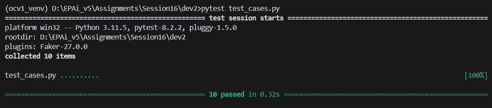

# EPAiV5-Session16 - Build a Dynamic Inventory System - Nested Dictionaries


## Introduction
This project implements a dynamic inventory management system using Python dictionaries, where each category of products is represented by a nested dictionary. The system supports various operations such as adding items, updating existing ones, querying inventory details, and merging multiple inventories. It also handles the nuances of deep and shallow copying to manage the inventory structure efficiently.

## Structure of the Inventory
- **Outer Dictionary (Categories)**: Each key in the outer dictionary represents a product category (e.g., Electronics, Groceries).
- **Nested Dictionary (Items)**: Each category contains a nested dictionary representing individual items. Each item has fields such as `name`, `price`, and `quantity`.

## Key Features
1. **Create Inventory:** The inventory is populated using a combination of dictionary comprehensions and the `dict()` constructor, demonstrating different methods of dictionary creation in Python.

2. **Update and Merge:** You can update the item information by adding new items or modifying existing ones. The system also supports merging two inventories without losing any data, ensuring quantities are aggregated, and prices are updated.

3. **Querying:** Several utility functions allow for retrieving items in a category, finding the most expensive item across the entire inventory, and checking the stock of specific items.

4. **Dictionary Views:** Users can view available categories, all items, and category-item pairs using dictionary view methods.

5. **Serialization (Copying):** The system implements functionality for both deep and shallow copying, allowing users to create independent copies of the inventory for different use cases.

## How the Code Handles the Requirements
#### 1. Create Inventory
The `create_inventory()` function initializes the inventory using different dictionary creation methods:
- Static Initialization: Some categories, such as Electronics, are initialized with a predefined dictionary.
- `dict()` Constructor: The Groceries category is initialized using Python's `dict()` constructor for flexibility.
- Dictionary Comprehension: The Clothing category demonstrates dynamic item creation using dictionary comprehension, adding multiple items with their price and default quantities.

This approach allows flexibility in populating the inventory, ensuring that the system can be extended or modified with ease.

#### 2. Update and Merge
The `update_inventory()` function updates existing items or adds new ones. It utilizes:

- `setdefault()` Method: Ensures that new categories can be added dynamically if they don’t exist.
- `update()` Method: Merges new information into the item's details, allowing for changes in price, quantity, and other attributes.

The `merge_inventories()` function combines two inventories, ensuring no data is lost:

- Deep Copy: First, it creates a deep copy of the original inventory.
- Quantity Aggregation: If an item exists in both inventories, their quantities are summed.
- Price Updating: The higher price between two inventories is retained for each item.

#### 3. Querying
Several utility functions enable powerful queries over the inventory:

- `get_items_in_category()`: Returns all items in a specified category.
- `find_most_expensive_item()`: Finds the most expensive item in the entire inventory using Python's `max()` function with a custom key.
- `check_item_in_stock()`: Searches for a specified item across categories and returns its details if it is in stock.
These functions are designed to handle real-time queries efficiently, supporting complex operations over nested data structures.

#### 4. Dictionary Views
Python's dictionary view methods are implemented to enhance usability:

- `view_categories()`: Returns a list of available categories (keys of the outer dictionary).
- `view_all_items()`: Aggregates and returns all items across all categories.
- `view_category_item_pairs()`: Returns a list of category-item pairs for easy viewing and iteration.
These methods utilize dictionary views to allow dynamic interaction with the structure without the need to modify the data.

#### 5. Serialization (Deep and Shallow Copying)
The `copy_inventory()` function supports both deep and shallow copies:

- Deep Copy: Creates a full copy of the inventory, ensuring any modifications to the copy don’t affect the original.
- Shallow Copy: Copies only the top-level structure, where changes to nested dictionaries will reflect in the original inventory.

This provides flexibility when handling inventory modifications or backups, offering performance optimization when deep copies are not necessary.

### Challenges Addressed
- Handling Nested Dictionary Structures: The system supports dynamic creation and updates of nested dictionaries, ensuring flexibility in managing product categories and items.

- Merging Inventories: The `merge_inventories()` function carefully handles item-level data aggregation (like summing quantities) while retaining critical information such as pricing and availability.

- Deep vs. Shallow Copying: By providing both deep and shallow copy mechanisms, the system efficiently handles scenarios where independent copies of the inventory are needed or where performance optimizations are required.

### Example Usage


```
inventory = create_inventory()
print("Initial Inventory:", inventory)

# Update an item
update_inventory(inventory, 'Electronics', 'Laptop', {'price': 1200, 'quantity': 8})
print("Updated Inventory:", inventory)

# Merge with another inventory
new_inventory = {'Electronics': {'Tablet': {'name': 'Tablet', 'price': 300, 'quantity': 7}}}
merged_inventory = merge_inventories(inventory, new_inventory)
print("Merged Inventory:", merged_inventory)

# Find the most expensive item
expensive_item = find_most_expensive_item(merged_inventory)
print("Most Expensive Item:", expensive_item)

```

### Test Results

#### Local PC Execution




#### Workflow Actions


---------------------------------------------------------------------------------------------------------------------------------------------------

**Submission by** - Hema Aparna M

**mail id** - mhema.aprai@gmail.com

---------------------------------------------------------------------------------------------------------------------------------------------------
